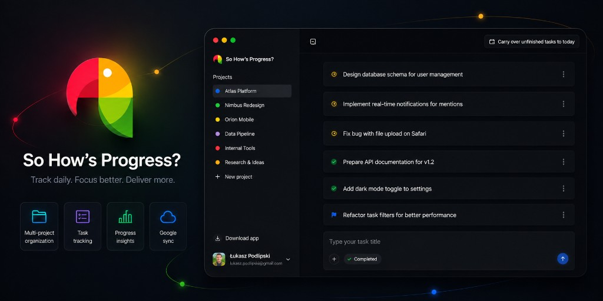

# So How's Progress?

> Track daily. Focus better. Deliver more.

So How's Progress? is a focused daily task tracker for people who work in projects and teams. Capture what you worked on each day, organize tasks by project, and keep your list ready for standups — in the browser or as a desktop app.

## Features

- **Projects** — separate task lists per project/workspace
- **Daily tasks** — to-do, in progress, done; drag & drop; grouped by date
- **Carry over** — move unfinished tasks from previous days to today
- **Sync** — Google sign-in + cloud sync, or local-only mode
- **Rich task details** — description, Git, Jira, and external links
- **Desktop app** — Windows and macOS builds
